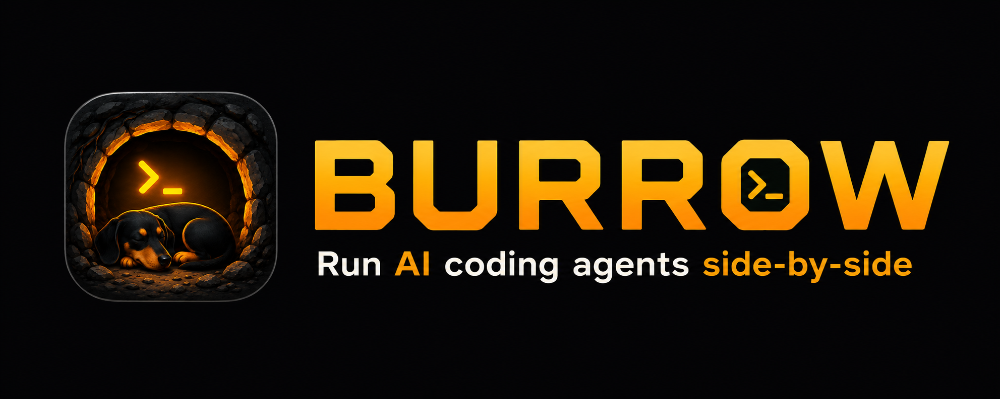
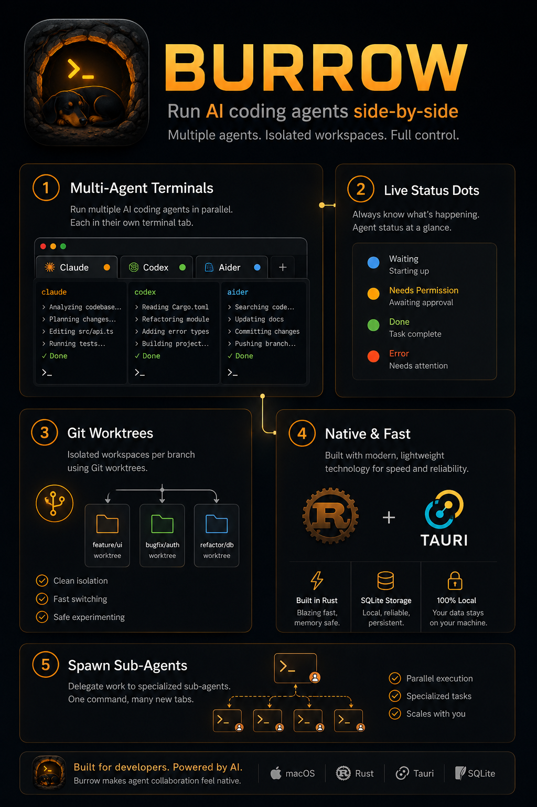

<p align="center">
  
</p>

<p align="center">
  <strong>A macOS-first desktop IDE that runs AI coding agents side-by-side in real terminal tabs.</strong>
</p>

<p align="center">
  
  
  
</p>

---

## What is Burrow

**Burrow** wraps real PTYs in a multi-workspace IDE shell, built to run AI coding agents — Claude Code, Codex, Aider, Copilot CLI — together in terminal tabs. Live status dots tell you which agent is working, waiting, blocked on permission, or done. Git worktrees give each branch its own isolated workspace. Agents can spawn sub-agents into new tabs and collect their results.

Subscription-safe: agents launch **interactively**, never via headless `-p` / Agent SDK.

<p align="center">
  
</p>

## Features

- **Multi-agent terminals** — run several AI agents in parallel tabs, each in its own workspace.
- **Live status dots** — blue = waiting, amber = needs permission, green = done/review, red = error. Driven by global, env-aware status hooks, so status works for any agent session (button-launched, hand-typed, or reattached after restart).
- **Git worktrees** — isolated workspace per branch, nested under its repo in the sidebar.
- **Spawn sub-agents** — delegate work to fresh tabs via the `burrow` CLI; collect results back.
- **Native & fast** — Rust/Tauri core, SQLite persistence, 100% local.
- **Mission Control** — live per-message transcript feed across all agents.
- **Auto-update** — signed updates via GitHub Releases.

## Stack

Vue 3 + Pinia + xterm.js frontend · Rust/Tauri v2 backend · SQLite persistence.

## Development

```bash
# Frontend-only dev (browser, no Tauri)
pnpm dev

# Full Tauri dev (native window, hot-reload)
pnpm tauri:dev

# Type-check + production build
pnpm build          # vue-tsc + vite build
pnpm tauri:build    # full native bundle

# Rust only
cd src-tauri && cargo check
```

## Documentation

Standalone HTML reference (no build step — open in a browser):

| File | Covers |
|------|--------|
| `docs/context.html` | Whole-project overview: architecture, features, key files, Tauri commands, shortcuts |
| `docs/burrow.html` | The `burrow` CLI: spawn/wait/capture, agent-docs install |

See [`CLAUDE.md`](CLAUDE.md) for full architecture notes.
